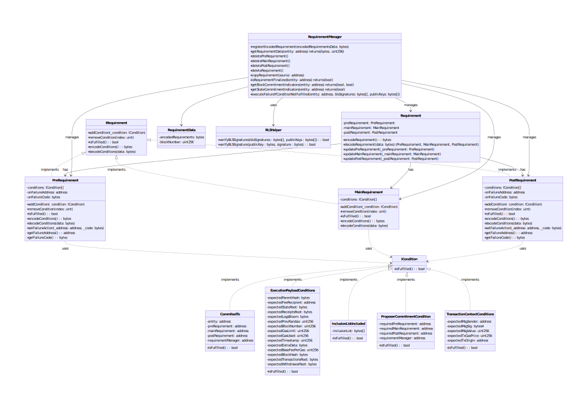

# Ethereum: Protocol Enforced Requirements
:warning: This repository is incomplete and currently a work in progress (WIP). Please carefully evaluate the SmartContracts provided here before using them.

## :fast_forward: Preamble
Protocol Enforced Requirements (PER) is a concept rooted in Protocol Enforced Proposer Commitments ([PEPC](https://ethresear.ch/t/unbundling-pbs-towards-protocol-enforced-proposer-commitments-pepc/13879/4)) and specifically requires the implementation of these commitments. For this approach, we are inclined towards an in-protocol solution for PEPC, particularly considering the Commitment-Satisfaction Committees ([CSC](https://ethresear.ch/t/commitment-satisfaction-committees-an-in-protocol-solution-to-pepc/17055)) as referenced in [EIP-7732](https://eips.ethereum.org/EIPS/eip-7732). An alternative approach is provided by 0xfuturistic with "[Emily](https://github.com/0xfuturistic/emily): A Protocol for Credible Commitments".

## :fast_forward: Structure
This repository includes a SmartContract, RequirementManager.sol, which acts as a registry for requirements received by an entity (Applicant, Proposer, Builder) within the network, facilitating the management of these requirements. This smart contract stores encoded byte strings representing objects of the type Requirement. The goal is to allow an entity in the network to register an encoded requirement in the contract, with the decoded version and the entity’s address being stored within the contract. To verify whether a specific condition is met for:
1. The inclusion of a transaction, OR
2. The creation of a block, OR
3. The status of an entity,
   
the decoded requirement (including the properties discussed below) can be retrieved from the register.

